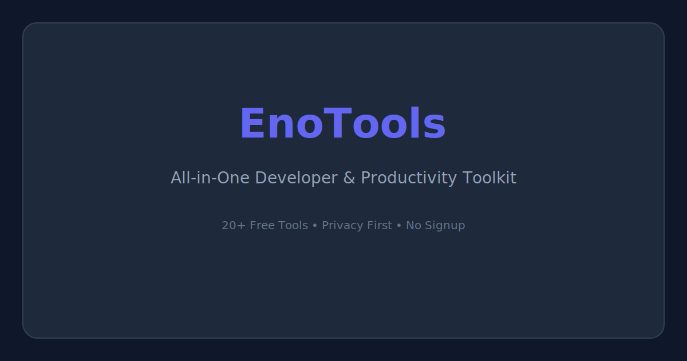

# EnoTools

> A modern, all-in-one utility platform for developers, designers, students, and office workers. Free, fast, and privacy-first — everything runs locally in your browser.



## Features

- **20+ Production-Ready Tools** — QR codes, JSON formatting, regex testing, encoding, hashing, and more
- **Privacy First** — All processing happens client-side; your data never leaves your browser
- **Dark Mode** — Beautiful dark/light theme with system preference detection
- **Fast Navigation** — Keyboard-driven search (⌘K), instant tool switching
- **Responsive Design** — Works perfectly on desktop, tablet, and mobile
- **SEO Optimized** — Open Graph tags, semantic HTML, structured metadata
- **No Signup Required** — Use all tools immediately, no accounts or limits

## Tools Included

### Encoding & Decoding
- **QR Code Generator** — Generate QR codes with PNG/SVG export and logo overlay
- **URL Encoder/Decoder** — Encode and decode URLs with component/URI modes
- **Base64 Encoder/Decoder** — UTF-8 support, URL-safe mode, file encoding
- **HTML Entity Encoder/Decoder** — Named and numeric entity conversion
- **JWT Decoder** — Inspect headers, payloads, and signatures with claim explanations

### Developer Tools
- **JSON Formatter** — Format, validate, minify, and tree-view JSON data
- **Regex Tester** — Live matching, flag controls, and pattern explanation panel
- **Hash Generator** — MD5, SHA-1, SHA-256, SHA-512 with file hashing support
- **Unix Timestamp Converter** — Multiple formats, timezone support, relative time
- **Color Palette Extractor** — Extract dominant colors from images using k-means clustering

### Text Tools
- **Text Diff Checker** — Line-by-line and word-level comparison with color coding
- **Markdown Editor** — Live preview, toolbar shortcuts, HTML/MD export
- **Word & Character Counter** — Reading time, speaking time, sentence analysis
- **Case Converter** — 12 case formats including camelCase, snake_case, kebab-case
- **Slug Generator** — URL-friendly slugs with configurable options and batch mode
- **Lorem Ipsum Generator** — Classic and hipster placeholder text

### CSS Tools
- **Box Shadow Generator** — Multi-layer shadows with presets and live preview
- **Border Radius Generator** — Individual corner control with drag handles

### Math & Conversion
- **Percentage Calculator** — 6 calculation modes with formula explanations
- **Unit Converter** — 8 categories: length, weight, temperature, area, volume, speed, time, data

## Tech Stack

- **Framework:** [Next.js 15](https://nextjs.org/) with App Router
- **Language:** [TypeScript](https://www.typescriptlang.org/)
- **Styling:** [Tailwind CSS](https://tailwindcss.com/) with custom design system
- **Icons:** [Lucide React](https://lucide.dev/)
- **Libraries:** qrcode, diff, marked, highlight.js

## Getting Started

### Prerequisites

- Node.js 18.17 or later
- npm, yarn, or pnpm

### Installation

```bash
# Clone the repository
git clone https://github.com/your-org/enotools.git
cd enotools

# Install dependencies
npm install

# Start development server
npm run dev
```

Open [http://localhost:3000](http://localhost:3000) in your browser.

### Build for Production

```bash
npm run build
npm start
```

## Project Structure

```
src/
├── app/
│   ├── layout.tsx          # Root layout with header/footer
│   ├── page.tsx            # Homepage with featured tools
│   ├── globals.css         # Global styles and Tailwind config
│   ├── tools/
│   │   ├── page.tsx        # All tools listing with search/filter
│   │   └── [slug]/
│   │       └── page.tsx    # Dynamic tool page
│   ├── categories/
│   │   └── page.tsx        # Category listing
│   └── category/
│       └── [slug]/
│           └── page.tsx    # Dynamic category page
├── components/
│   ├── Header.tsx          # Navigation with dark mode toggle
│   ├── Footer.tsx          # Site footer
│   ├── SearchModal.tsx     # ⌘K search modal
│   ├── ToolCard.tsx        # Tool card component
│   ├── ToolPageWrapper.tsx # Tool page layout wrapper
│   ├── ToolRenderer.tsx    # Dynamic tool component loader
│   ├── CopyButton.tsx      # Reusable copy-to-clipboard button
│   └── tools/              # Individual tool implementations
│       ├── QrCodeGenerator.tsx
│       ├── JsonFormatter.tsx
│       ├── RegexTester.tsx
│       └── ... (20 tool files)
└── lib/
    └── tools.ts            # Tool registry and search logic
```

## Deployment

### Vercel (Recommended)

[](https://vercel.com/new/clone?repository-url=https://github.com/your-org/enotools)

1. Push your code to GitHub
2. Import the project in [Vercel](https://vercel.com)
3. Vercel auto-detects Next.js and deploys with zero configuration

### Other Platforms

```bash
# Build static export
npm run build

# The output is in the `out/` directory
# Deploy to any static hosting (Netlify, Cloudflare Pages, etc.)
```

## Screenshots

> Coming soon — screenshots of the homepage, tool pages, and dark mode.

## Roadmap

- [ ] More tools: Markdown to PDF, Color Converter, Lorem Image generator
- [ ] Tool favorites with local storage persistence
- [ ] Tool usage history
- [ ] PWA support for offline usage
- [ ] Tool sharing with pre-filled parameters
- [ ] Keyboard shortcuts for all tools
- [ ] API endpoints for programmatic access
- [ ] Plugin system for community tools

## Contributing

Contributions are welcome! Please feel free to submit a Pull Request.

1. Fork the repository
2. Create your feature branch (`git checkout -b feature/amazing-tool`)
3. Commit your changes (`git commit -m 'Add amazing tool'`)
4. Push to the branch (`git push origin feature/amazing-tool`)
5. Open a Pull Request

### Adding a New Tool

1. Create a new component in `src/components/tools/`
2. Add the tool definition to `src/lib/tools.ts`
3. Register the component in `src/components/ToolRenderer.tsx`
4. The tool automatically appears on the homepage and in search

## License

MIT License — see [LICENSE](LICENSE) for details.

---

Built with ❤️ using Next.js, TypeScript, and Tailwind CSS.
